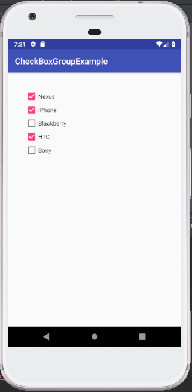
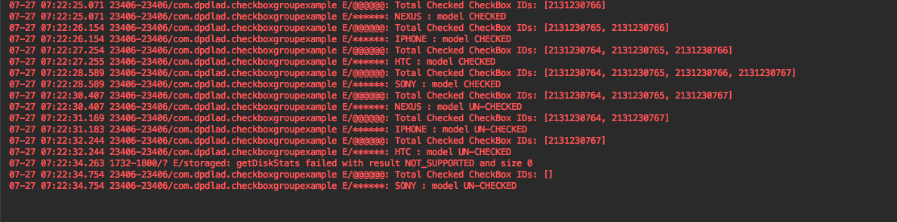

# Android-CheckBoxGroup

This library will provide CheckBoxGroup component, which is used to monitor the collection of CheckBox state changes. 
It would behave like RadiGroup widget.  Android has RadioGroup widget for tracking state changes of RadioButtons. But CheckBox doesn't have any components like that.(It doesn’t needed unless you use Checkboxes heavily) This component/widget  will notify you if any CheckBox state has changed and also it gives all selected CheckBoxes IDs to registered users.


#### maven metadata.xml
```
<metadata>
<groupId>com.github.praveen2gemini</groupId>
<artifactId>CheckBoxGroup</artifactId>
<versioning>
<versions>
<version>0.0.1-SNAPSHOT</version>
</versions>
<lastUpdated>20180727021625</lastUpdated>
</versioning>
</metadata>
```


#### Add following line to app/build.gradle
```
implementation 'com.github.praveen2gemini:CheckBoxGroup:0.0.1-SNAPSHOT@aar'
```

####  activity_main.xml
```
  <com.github.praveen2gemini.CheckBoxGroup
        android:id="@+id/check_group_id"
        android:layout_width="match_parent"
        android:layout_height="wrap_content"
        android:layout_margin="@dimen/activity_margin_vertical"
        android:orientation="vertical">

        <CheckBox
            android:id="@+id/check_nexus_id"
            android:layout_width="wrap_content"
            android:layout_height="wrap_content"
            android:text="Nexus" />
            
        <CheckBox
            android:id="@+id/check_iphone_id"
            android:layout_width="wrap_content"
            android:layout_height="wrap_content"
            android:text="iPhone" />

        <CheckBox
            android:id="@+id/check_blackberry_id"
            android:layout_width="wrap_content"
            android:layout_height="wrap_content"
            android:text="Blackberry" />

        <CheckBox
            android:id="@+id/check_htc_id"
            android:layout_width="wrap_content"
            android:layout_height="wrap_content"
            android:text="HTC" />

        <CheckBox
            android:id="@+id/check_sony_id"
            android:layout_width="wrap_content"
            android:layout_height="wrap_content"
            android:text="Sony" />
    </com.github.praveen2gemini.CheckBoxGroup>
```

####  MainActivity.kt

##### Set/Implement setOnCheckChangedListener to your activity or fragment. 
##### It will receive state changes of the checkboxes, if it got changed.

 ```
 override fun onCreate(savedInstanceState: Bundle?) {
         super.onCreate(savedInstanceState)
         setContentView(R.layout.activity_main)
         (findViewById<CheckBoxGroup>(R.id.check_group_id))
                 .setOnCheckedChangeListener(this)
 } 
override fun onCheckedChanged(group: CheckBoxGroup, checkedId: Int, isChecked: Boolean) {
        val allSelectedCheckboxIds = group.checkedCheckboxButtonId
         Log.e("@@@@@@", "Total Checked CheckBox IDs: $allSelectedCheckboxIds")
             when (checkedId) {
                R.id.check_nexus_id -> printLogInfo("NEXUS ", isChecked)
                R.id.check_iphone_id -> printLogInfo("IPHONE ", isChecked)
                R.id.check_blackberry_id -> printLogInfo("BLACKBERRY ", isChecked)
                R.id.check_htc_id -> printLogInfo("HTC ", isChecked)
                R.id.check_sony_id -> printLogInfo("SONY ", isChecked)
                else -> printLogInfo("NOTHING ", isChecked)
          }
    }
```


 


